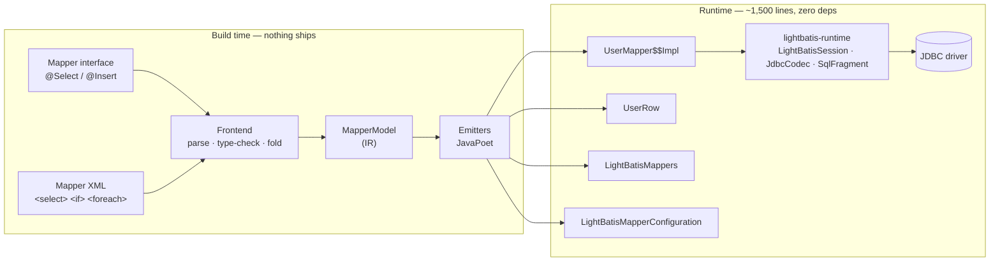

# Architecture

Two phases and one intermediate representation. Everything in the build phase is thrown
away before the application runs; everything in the runtime phase is code you can read.

## The repositories

Four independent repositories, because they have different lifecycles and different
answers to "does this reach an application's runtime classpath".

| Repository | Modules | Scope |
|---|---|---|
| `lightbatis` | `lightbatis-annotations` | runtime — annotations only, no logic |
| | `lightbatis-runtime` | runtime — zero dependencies beyond JDBC |
| | `lightbatis-processor` | **build-only** — the generator |
| `lightbatis-gradle-plugin` | — | build-only — plugin id `io.github.lightbatis` |
| `lightbatis-maven-plugin` | — | build-only — same job for Maven |
| `lightbatis-spring` | `lightbatis-spring`, `-spring-boot-autoconfigure`, `-spring-boot-starter` | runtime — transactions, Boot auto-config |

The rule that keeps this honest: **build-only modules must never leak onto an
application's runtime classpath.** The generator is a compile-time tool; if it can be
reached at runtime, someone will eventually reach for it, and the design's central claim
stops being checkable.

## The build phase

### Frontend

Two frontends, one output. The annotation path runs as a plain
`javax.annotation.processing.Processor`. The XML path parses mapper files handed to it as
directory paths by the build plugin. Both produce the same IR, so there is one set of
emitters and one set of semantics — not two code paths that drift.

The frontend does all the work that "resolving the shape" means:

- parse the SQL text, turning `#{}` into positional binds and `${}` into checked splices
- resolve every `#{}` name against the method's parameter types, walking property paths
- parse the select list, when it parses, to fix column positions
- choose the read and write helper for every value from its declared Java type
- compile every `<if test>` into a Java boolean expression, or reject it
- constant-fold `<where>`, `<set>`, `<trim>` into guarded literal appends
- inline `<sql>`/`<include>`
- lower `<foreach>` into a placeholder loop and a binding loop

Anything it cannot decide is a compile error naming the mapper method — never a runtime
fallback.

### The IR

`MapperModel` is the boundary. It carries statements, parameters, result shapes, dynamic
nodes, key models and reader access strategies, and it is deliberately not shaped like
either frontend. Golden snapshots of the IR are part of the test suite, so a frontend
change that alters meaning shows up as an IR diff before it becomes a generated-code diff.

### Emitters

JavaPoet, one emitter per artefact:

| Emitter | Output |
|---|---|
| `MapperImplEmitter` | `UserMapper$$Impl` — one per mapper |
| `RowReaderEmitter` | `UserRow` — one per result class |
| `RegistryEmitter` | `LightBatisMappers` — one per compilation |
| `SpringConfigurationEmitter` | `LightBatisMapperConfiguration` — when spring-context is on the build classpath |

The registry emitter is why the processor is **aggregating**: it needs every mapper in the
compilation to write one complete registry. That is also why
`useIncrementalCompilation=false` breaks Maven builds — recompiling only stale sources
would regenerate the registry from a partial view.

## The runtime phase

`lightbatis-runtime` is small enough to list:

| Type | Job |
|---|---|
| `LightBatisSession` | Borrow a `Connection`, give it back, translate exceptions. The whole environment a generated mapper needs |
| `JdbcLightBatisSession` | The standalone implementation, plus `LightBatisTx` |
| `SpringLightBatisSession` | The Spring one — `DataSourceUtils` instead of `dataSource.getConnection()` |
| `JdbcCodec` | Null-aware and converting read/write helpers. The inlined remains of the `TypeHandler` layer |
| `SqlFragment` | The one gate arbitrary SQL text passes through |
| `LightBatisSql` | `trackVariants`, `padPow2`, `sum` — static helpers referenced by generated code |
| `RowReader`, `StatementBinder` | Two functional interfaces the escape hatch takes |
| `ResultSetStream` | Cursor-backed `Stream` with resource ownership |
| `LightBatisException` + subclasses | The unchecked exception tree |

Nothing in that list inspects a type, resolves a name, or consults a registry. That all
happened at build time.

## Why a build-tool plugin exists at all

`Filer.getResource` is not specified to reach files under `src/main/resources`, and the
implementations that do reach them do not agree on how. So the processor reads mapper XML
with plain `java.io` and takes a directory path as an option instead. Something has to
supply that path **and** register the XML files as compile inputs, or an XML-only edit
would not regenerate anything.

That is the entire reason both build plugins exist. Neither generates code; all generation
stays inside javac. See [Build Plugins](../getting-started/build-plugins.md).

## Verification strategy

Three layers, because "the generated code compiles" proves very little:

1. **A hand-written emitter spec.** Before the emitters existed, the target shape of
   generated code was written out by hand as compiling, tested Java. The emitters are
   measured against it.
2. **Golden snapshots.** Generated output for a corpus of mappers is committed and
   diffed. An intended emitter change is a reviewed diff, not an invisible one.
3. **Differential tests.** The same mapper runs through MyBatis's interpreted path and
   through the generated code against a recording `DataSource`; the SQL text and the
   parameter bindings are compared. A sweep over the mapper XML corpus in the MyBatis
   source tree is how the expression grammar's real-world coverage was measured rather
   than guessed.

Plus a `CompileFailTest` for every "this is a compile error" promise the documentation
makes — including the ones on this site.
