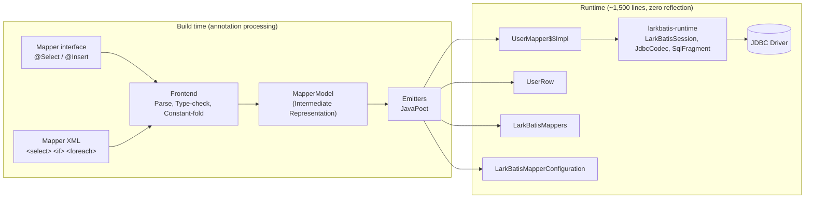

# Architecture

LarkBatis splits its work into two distinct stages: a compile-time build phase and a lightweight runtime phase. Everything in the build phase is discarded once `javac` finishes; only clean, standard Java bytecode is packaged into your application.

## Repository & Module Structure

The project is divided across four repositories based on lifecycle boundaries:

| Repository | Modules | Role |
|---|---|---|
| `larkbatis` | `larkbatis-annotations` | Compile-time annotations only (no runtime logic) |
| | `larkbatis-runtime` | Core runtime (zero dependencies beyond standard JDBC) |
| | `larkbatis-processor` | Build-only annotation processor (`javac`) |
| `larkbatis-gradle-plugin` | | Build-only Gradle plugin (`io.github.larkbatis`) |
| `larkbatis-maven-plugin` | | Build-only Maven plugin |
| `larkbatis-spring` | `larkbatis-spring`, `-autoconfigure`, `-starter` | Spring transaction integration and Spring Boot auto-configuration |

**Key architectural rule**: Build-only modules (`larkbatis-processor`, Gradle/Maven plugins) are never included on an application's runtime classpath.

## The Build Phase

### Frontend Parsing

LarkBatis provides two frontends that feed into the same intermediate model:

1. **Annotation frontend**: Analyzes Java mapper interfaces using standard `javax.annotation.processing.Processor` APIs.
2. **XML frontend**: Parses XML mapper files from directories provided by the build plugin.

Both frontends perform static analysis:

- Convert `#{}` parameter references into typed positional JDBC bind parameters.
- Validate parameter names against method signatures and object property paths at compile time.
- Parse `SELECT` column lists to hardcode indexed column reading.
- Select typed `JdbcCodec` read and write helpers based on declared Java types.
- Compile `<if test="...">` conditions into plain Java boolean expressions.
- Constant-fold `<where>`, `<set>`, and `<trim>` clauses into guarded string appends.
- Inline static `<sql>` / `<include>` fragments.
- Compile `<foreach>` loops into placeholder generator and parameter binding loops.

If any query shape or binding cannot be resolved at compile time, `javac` fails immediately with a clear error pointing to the method or XML line.

### Intermediate Representation (IR)

`MapperModel` acts as the compiler boundary. It models statements, parameters, result column mappings, dynamic AST nodes, and generated key configurations. Golden snapshot tests verify the IR directly, ensuring frontend parsing changes are caught before bytecode emission.

### Code Emitters

LarkBatis uses JavaPoet to emit clean Java source files:

| Emitter | Emitted Class | Description |
|---|---|---|
| `MapperImplEmitter` | `UserMapper$$Impl` | Concrete mapper implementation executing JDBC calls |
| `RowReaderEmitter` | `UserRow` | Static row reader for result mapping |
| `RegistryEmitter` | `LarkBatisMappers` | Central mapper factory registry |
| `SpringConfigurationEmitter` | `LarkBatisMapperConfiguration` | Spring `@Configuration` with `@Bean` definitions |

## The Runtime Phase

`larkbatis-runtime` is intentionally tiny (~1,500 lines) and contains only essential abstractions:

- **`LarkBatisSession`**: Acquires and releases database connections and translates JDBC exceptions.
- **`JdbcLarkBatisSession`**: Standalone session implementation managing `LarkBatisTx` transactions.
- **`SpringLarkBatisSession`**: Spring integration delegating to `DataSourceUtils` and Spring exception translators.
- **`JdbcCodec`**: Static, inlined read/write helpers with null handling for primitives, dates, and enums.
- **`SqlFragment`**: Safe wrapper for dynamic SQL text.
- **`LarkBatisSql`**: Utility helpers for query variant tracking and batch update calculations.
- **`RowReader<T>` & `StatementBinder`**: Functional interfaces used by the dynamic SQL escape hatch.
- **`LarkBatisException`**: Root unchecked exception hierarchy.

## Why Build Plugins Are Used

Annotation processors cannot discover mapper XML files located in arbitrary directory structures via standard `Filer` APIs. Gradle and Maven plugins register mapper XML directories as compilation inputs and pass them cleanly to javac via `-Alarkbatis.mapperDir`. All code generation remains strictly inside `javac`. See [Build Plugins](../getting-started/build-plugins.md).

## Verification & Testing

LarkBatis employs a three-tier test suite to guarantee correctness:

1. **Emitter Specifications**: Reference implementations written by hand to define expected generated code patterns.
2. **Golden Snapshots**: Emitted code across a broad test suite is committed and diffed on changes.
3. **Differential Test Suite**: Executes mappers against both standard MyBatis (runtime interpreter) and LarkBatis (generated code) using a recording JDBC `DataSource`, verifying that generated SQL queries, parameter binds, and result mappings match identically.
4. **Compile-Fail Test Suite**: Validates that invalid XML tags, unsupported OGNL expressions, and unsafe `${}` splices produce expected compile-time errors.
