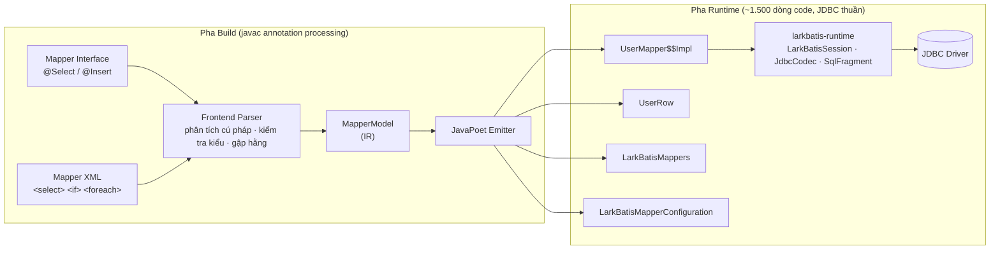

# Kiến trúc tổng thể

Kiến trúc LarkBatis gồm hai pha tách biệt rõ ràng và một mô hình biểu diễn trung gian (Intermediate Representation - IR). Mọi công việc phân tích, kiểm tra kiểu dữ liệu và sinh mã nguồn diễn ra hoàn toàn trong pha build; runtime chỉ là một lớp mỏng gọi JDBC trực tiếp.

## Phân chia Repository và Module

| Repository | Module | Phạm vi sử dụng |
|---|---|---|
| `larkbatis` | `larkbatis-annotations` | Annotation-only (phạm vi `CLASS`), không chứa logic |
| | `larkbatis-runtime` | Runtime core: JDBC thuần (~1.500 dòng code) |
| | `larkbatis-processor` | **Build-time only**: Annotation processor sinh mã nguồn |
| `larkbatis-gradle-plugin` | Plugin ID `io.github.larkbatis` | **Build-time only**: Tự động cấu hình Gradle task và incremental input |
| `larkbatis-maven-plugin` | Maven Plugin | **Build-time only**: Cấu hình compiler path và refresh XML |
| `larkbatis-spring` | `larkbatis-spring`, starter, autoconfigure | Tích hợp Spring Boot và `DataSourceUtils` |

Quy tắc bất biến: **Các module build-time tuyệt đối không xuất hiện trên runtime classpath của ứng dụng.**

## Pha Build (Compile-Time)

### Frontend Parser

LarkBatis hỗ trợ 2 frontend đầu vào: Java Annotation (`@Select`, `@Insert`, v.v.) và XML Mapper. Cả hai đều được chuyển đổi về cùng một cấu trúc `MapperModel` (IR) duy nhất:

- Phân tích cú pháp câu SQL, chuyển `#{}` thành các vị trí parameter bind và kiểm tra an toàn cho `${}`.
- Kiểm tra kiểu dữ liệu tĩnh của các tham số và truy vết getter thuộc tính.
- Phân tích danh sách SELECT để cố định index đọc cột trong `ResultSet`.
- Chọn hàm chuyển đổi kiểu dữ liệu tối ưu trong `JdbcCodec`.
- Biên dịch các biểu thức `test` trong thẻ `<if>` thành mã Java boolean tương ứng.
- Tối ưu tiền tố/hậu tố của `<where>`, `<set>`, `<trim>`.
- Inlined các thẻ `<sql>` / `<include>` trực tiếp vào vị trí gọi.
- Biên dịch `<foreach>` thành hai vòng lặp duyệt tuần tự.

### Intermediate Representation (IR)

`MapperModel` đóng vai trò là ranh giới trừu tượng độc lập giữa frontend parser và backend code emitter. IR mang đầy đủ thông tin về statement, kiểu tham số, cấu trúc kết quả và chiến lược đọc dòng.

### JavaPoet Emitter

Hệ thống sử dụng JavaPoet để sinh ra 4 nhóm file Java:

| Emitter | File sinh ra | Nhiệm vụ |
|---|---|---|
| `MapperImplEmitter` | `UserMapper$$Impl.java` | Lớp triển khai JDBC cho từng mapper interface |
| `RowReaderEmitter` | `UserRow.java` | Lớp đọc dữ liệu `ResultSet` cho từng POJO kết quả |
| `RegistryEmitter` | `LarkBatisMappers.java` | Static factory khởi tạo các mapper trong lần build |
| `SpringConfigurationEmitter` | `LarkBatisMapperConfiguration.java` | Class `@Configuration` đăng ký Spring Bean |

## Pha Runtime

Thư viện runtime `larkbatis-runtime` có kích thước nhỏ gọn:

| Thành phần | Vai trò |
|---|---|
| `LarkBatisSession` | Interface quản lý kết nối JDBC, giải phóng connection và dịch mã lỗi |
| `JdbcLarkBatisSession` | Triển khai cho standalone JDBC, tích hợp `LarkBatisTx` |
| `SpringLarkBatisSession` | Triển khai cho Spring Boot, tích hợp `DataSourceUtils` |
| `JdbcCodec` | Tập hợp các static helper đọc/ghi dữ liệu JDBC có xử lý null an toàn |
| `SqlFragment` | Cổng kiểm soát duy nhất cho các chuỗi SQL động |
| `LarkBatisSql` | Các hàm tiện ích hỗ trợ runtime (`trackVariants`, `padPow2`, `sum`) |
| `RowReader`, `StatementBinder` | Functional interfaces phục vụ các truy vấn động thủ công |
| `LarkBatisException` | Cây unchecked exception mang theo câu lệnh SQL gây lỗi |

## Chiến lược kiểm chứng chất lượng

1. **Emitter Specification Tests**: Đo lường mã nguồn sinh ra so với các class mẫu viết tay chuẩn mực.
2. **Snapshot Testing (Golden Master)**: Lưu trữ bản chụp mã nguồn sinh ra của kho mapper và kiểm tra sự sai khác (diff) qua từng lần commit.
3. **Differential Testing với MyBatis**: Chạy song song cùng một mapper trên cả hai runtime (MyBatis và LarkBatis), so sánh từng chuỗi SQL sinh ra và từng tham số JDBC bind trên cùng một DataSource mô phỏng.
4. **CompileFailTest**: Đảm bảo tất cả các quy tắc vi phạm cú pháp hoặc kiểu dữ liệu đều được `javac` bắt chính xác và báo lỗi biên dịch rõ ràng.

