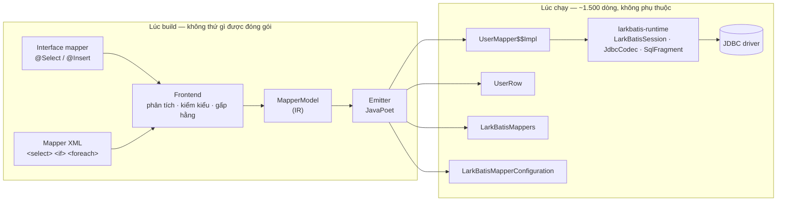

# Kiến trúc

Hai pha và một IR. Mọi thứ ở pha build đều bị vứt đi trước khi ứng dụng chạy; mọi thứ ở
pha runtime đều là code đọc được.

## Các repository

Bốn repository độc lập, bởi vì chúng có vòng đời khác nhau và câu trả lời khác nhau cho
câu hỏi "thứ này có chạm tới classpath lúc chạy của ứng dụng không".

| Repository | Module | Phạm vi |
|---|---|---|
| `larkbatis` | `larkbatis-annotations` | runtime: chỉ annotation, không logic |
| | `larkbatis-runtime` | runtime: không phụ thuộc gì ngoài JDBC |
| | `larkbatis-processor` | **chỉ lúc build**: bộ sinh code |
| `larkbatis-gradle-plugin` | | chỉ lúc build: plugin id `io.github.larkbatis` |
| `larkbatis-maven-plugin` | | chỉ lúc build: cùng nhiệm vụ cho Maven |
| `larkbatis-spring` | `larkbatis-spring`, `-spring-boot-autoconfigure`, `-spring-boot-starter` | runtime: transaction, auto-config cho Boot |

Quy tắc giữ cho điều này trung thực: **module chỉ dùng lúc build tuyệt đối không được lọt
ra classpath lúc chạy của ứng dụng.** Bộ sinh code là một công cụ lúc biên dịch; nếu với
tới được nó lúc chạy thì sớm muộn sẽ có người với tới, và khẳng định trung tâm của thiết
kế không còn kiểm chứng được nữa.

## Pha build

### Frontend

Hai frontend, một đầu ra. Đường annotation chạy như một
`javax.annotation.processing.Processor` thuần. Đường XML phân tích các file mapper được
plugin build đưa cho dưới dạng đường dẫn thư mục. Cả hai sinh ra cùng một IR. Chỉ có một bộ
emitter, một bộ ngữ nghĩa, và không có đường code thứ hai để mà lệch dần đi.

Frontend làm toàn bộ phần việc mà "resolve shape" nghĩa là:

- phân tích câu SQL, biến `#{}` thành các chỗ bind theo vị trí và `${}` thành các chỗ
  chèn đã được kiểm tra
- resolve mọi tên `#{}` dựa trên kiểu tham số của phương thức, đi dọc các đường dẫn
  property
- phân tích select list, khi nó phân tích được, để cố định vị trí cột
- chọn hàm đọc và hàm ghi cho mọi giá trị từ kiểu Java khai báo của nó
- biên dịch mọi `<if test>` thành một biểu thức boolean Java, hoặc từ chối nó
- gấp `<where>`, `<set>`, `<trim>` thành hằng cùng các lệnh nối chỉ chạy khi điều kiện
  đúng
- chèn thẳng `<sql>`/`<include>` vào chỗ dùng
- chuyển `<foreach>` thành một vòng lặp placeholder và một vòng lặp bind giá trị

Bất cứ thứ gì nó không quyết được đều là lỗi biên dịch nêu tên phương thức mapper, không
bao giờ là một phương án lùi lúc chạy.

### IR

`MapperModel` là ranh giới. Nó mang theo statement, tham số, hình dạng kết quả, các nút
động, mô hình khoá và chiến lược truy cập của reader, và nó cố ý không mang hình dạng của
frontend nào cả. Ảnh chụp chuẩn của IR là một phần của bộ test, nên một thay đổi ở
frontend làm đổi ngữ nghĩa sẽ lộ ra dưới dạng diff của IR trước khi nó thành diff của code
sinh ra.

### Emitter

JavaPoet, mỗi sản phẩm một emitter:

| Emitter | Đầu ra |
|---|---|
| `MapperImplEmitter` | `UserMapper$$Impl`, mỗi mapper một cái |
| `RowReaderEmitter` | `UserRow`, mỗi lớp kết quả một cái |
| `RegistryEmitter` | `LarkBatisMappers`, mỗi lần biên dịch một cái |
| `SpringConfigurationEmitter` | `LarkBatisMapperConfiguration`, khi spring-context có trên classpath lúc build |

Emitter cho registry là lý do processor thuộc loại **aggregating**: nó cần mọi mapper
trong lần biên dịch để viết ra một registry đầy đủ. Cũng chính yêu cầu đó làm hỏng các bản
build Maven khi bật `useIncrementalCompilation=false`, vì chỉ biên dịch lại những file đã
cũ sẽ sinh lại registry từ một góc nhìn thiếu.

## Pha runtime

`larkbatis-runtime` nhỏ tới mức liệt kê ra được hết:

| Kiểu | Nhiệm vụ |
|---|---|
| `LarkBatisSession` | Mượn một `Connection`, trả nó lại, dịch exception. Toàn bộ môi trường mà một mapper sinh ra cần |
| `JdbcLarkBatisSession` | Bản hiện thực độc lập, kèm `LarkBatisTx` |
| `SpringLarkBatisSession` | Bản cho Spring: `DataSourceUtils` thay cho `dataSource.getConnection()` |
| `JdbcCodec` | Các hàm đọc/ghi có nhận biết null và có chuyển đổi. Tàn dư của tầng `TypeHandler`, đã chèn thẳng vào code sinh ra |
| `SqlFragment` | Cái cổng duy nhất mà câu SQL tuỳ ý phải đi qua |
| `LarkBatisSql` | Các hàm tĩnh mà code sinh ra tham chiếu tới: `trackVariants`, `padPow2`, `sum` |
| `RowReader`, `StatementBinder` | Hai functional interface mà cửa thoát hiểm nhận vào |
| `ResultSetStream` | `Stream` dựa trên con trỏ, có quyền sở hữu tài nguyên |
| `LarkBatisException` + các lớp con | Cây exception unchecked |

Không thứ nào trong danh sách đó đi soi kiểu, resolve tên, hay tra một registry. Tất cả
những việc đó đã xảy ra lúc build.

## Vì sao lại phải có plugin cho công cụ build

Processor không với tới mapper XML qua `Filer.getResource` được, nên nó nhận một đường
dẫn thư mục qua tuỳ chọn, và phải có thứ gì đó cung cấp đường dẫn ấy. Hai plugin build
tồn tại chỉ vì việc đó. Không plugin nào sinh code; toàn bộ việc sinh code nằm bên trong
javac. [Plugin build](../getting-started/build-plugins.md) có đầy đủ lý do.

## Chiến lược kiểm chứng

Ba tầng, bởi vì "code sinh ra biên dịch được" chứng minh rất ít:

1. **Một bản đặc tả emitter viết tay.** Trước khi các emitter tồn tại, hình dạng đích của
   code sinh ra đã được viết tay ra thành Java biên dịch được và có test. Các emitter được
   đo lại theo bản đó.
2. **Ảnh chụp chuẩn.** Đầu ra sinh ra cho một kho mapper được commit lại và đem diff. Một
   thay đổi có chủ ý ở emitter là một diff được review, không phải một thay đổi vô hình.
3. **Kiểm thử vi sai.** Cùng một mapper chạy qua đường thông dịch của MyBatis và qua code
   sinh ra, đối diện một `DataSource` ghi lại mọi thứ; câu SQL và các tham số bind
   được đem so sánh. Một lượt quét toàn bộ kho mapper XML trong cây mã nguồn MyBatis là
   cách độ phủ thực tế của ngữ pháp biểu thức được đo đạc chứ không phải phỏng đoán.

Cộng thêm một `CompileFailTest` cho mỗi lời hứa "đây là lỗi biên dịch" mà tài liệu đưa ra,
kể cả những lời hứa trên chính trang web này.
