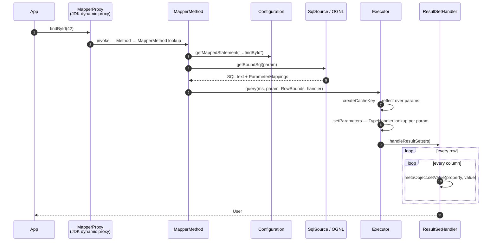
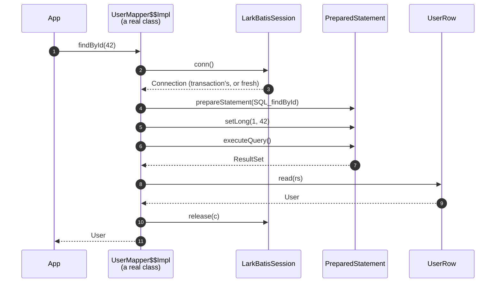

# Call Lifecycle

Let's trace a single mapper call under standard MyBatis versus LarkBatis. Both use the identical Java interface, SQL statement, and result class:

```java
User u = mapper.findById(42);
```

## MyBatis Execution Flow



MyBatis performs multiple layers of reflection and runtime lookups: `createCacheKey`, `getBoundSql` (runtime OGNL evaluation for dynamic SQL), `TypeHandler` parameter lookups, and `handleResultSets`. The result set mapping is by far the most expensive step because it runs for every single column of every single row.

## LarkBatis Execution Flow



In LarkBatis, there is no dynamic proxy, no statement map lookup, and no runtime expression interpreter. The column positions, parameter types, and setter calls were fixed during compilation.

## Column Assignment: Under the Hood

The performance difference between the two approaches is most visible in result set processing.

For **every single column of every row**, MyBatis executes:

```java
metaObject.setValue("userName", v)
//  1. new PropertyTokenizer(name)        allocation + string parsing
//  2. BeanWrapper.set(prop, value)
//  3. metaClass.getSetInvoker(name)      HashMap lookup by String
//  4. Object[] params = { value }        allocation
//  5. method.invoke(obj, params)         reflective method invocation
```

LarkBatis executes direct, hardcoded bytecode:

```java
u.setUserName(rs.getString(4));
```

For a query returning 1,000 rows with 10 columns:

- **MyBatis**: 10,000 `PropertyTokenizer` allocations + 10,000 `Object[]` arrays + 10,000 map lookups + 10,000 reflective `Method.invoke()` calls.
- **LarkBatis**: 10,000 direct setter calls reading directly from indexed columns.

The JIT compiler cannot eliminate MyBatis's allocations via escape analysis because the `setValue → BeanWrapper → Invoker` call chain is too deep.

## What Actually Runs at Runtime

To be transparent about runtime execution:

| Operation | Execution Details |
|---|---|
| `s.conn()` / `s.release(c)` | Obtains/returns connection from datasource or active transaction |
| `ps.setLong(1, 42)` | Positional JDBC parameter binding |
| `ps.executeQuery()` | Database query execution and network round-trip |
| `rs.getString(2)` | JDBC driver column decoding |
| Dynamic SQL generation | Evaluates `<if>` booleans once and appends to a local `StringBuilder` |
| `<foreach>` loops | Two loops: one generates placeholder strings (`?, ?`), one binds values |
| SQL variant monitoring | One `ConcurrentHashMap` variant count check for dynamic queries |

LarkBatis removes the intermediate abstraction layers between your application and JDBC.

## Where Performance Gains Matter Most

For a simple `findById` query returning a single row, the database network latency dominates total execution time—LarkBatis saves a few microseconds of CPU time.

However, for report queries, batch processing, exports, and multi-row list queries returning thousands of rows, eliminating per-row reflection and intermediate object allocations reduces query processing overhead significantly.
