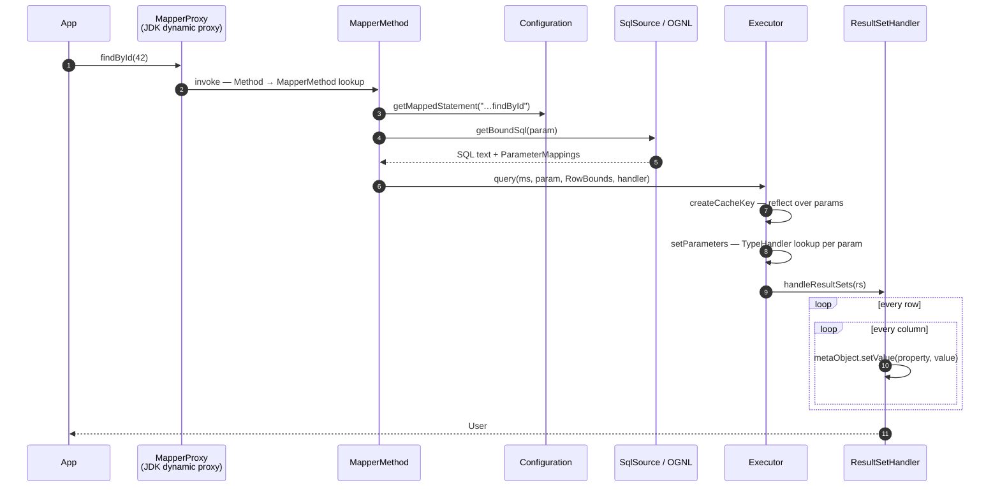
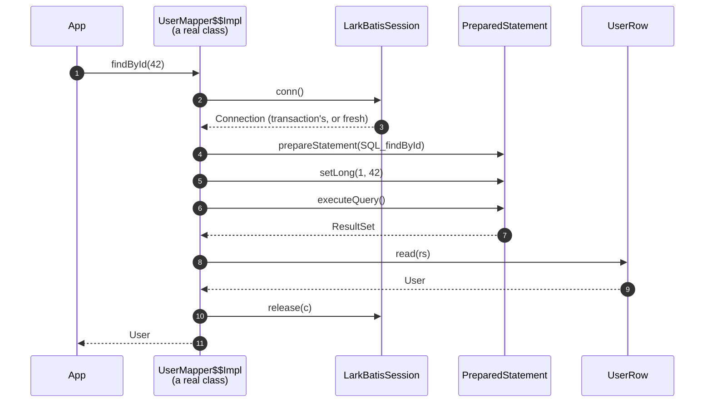

# Life of a Call

One mapper call, both ways. Same interface, same SQL, same result.

```java
User u = mapper.findById(42);
```

## MyBatis



Four groups of reflective work on that path: `createCacheKey`, `getBoundSql` (OGNL when
the statement is dynamic), `setParameters`, and `handleResultSets`. The last one is the
expensive one, because it runs per column per row.

## LarkBatis



No proxy, no lookup, no evaluation. The steps that disappeared did not move somewhere
else. They were performed at build time, and their answers are literals in the source.

## The column assignment, side by side

The measured difference lives here. For **every column of every row**, MyBatis does:

```java
metaObject.setValue("userName", v)
//  ① new PropertyTokenizer(name)        allocation + indexOf + substring
//  ② BeanWrapper.set(prop, value)
//  ③ metaClass.getSetInvoker(name)      HashMap lookup by String
//  ④ Object[] params = { value }        allocation
//  ⑤ method.invoke(obj, params)         reflective call
```

LarkBatis does:

```java
u.setUserName(rs.getString(4));
// the property name disappeared at build time
// the column index 4 was chosen at build time
// what is left is a putfield
```

For a 10-column × 1,000-row result, that is **10,000 `PropertyTokenizer` allocations +
10,000 `Object[]` allocations + 10,000 map lookups + 10,000 `Method.invoke` calls**, to
perform 10,000 assignments that are fundamentally a `putfield`.

!!! note "The interesting part is not ⑤"

    Since JDK 18, core reflection is built on method handles and a hot `Method.invoke` is
    very close to a direct call. The reliable saving is in ①③④, the work that exists
    *only* because the property name is a string that has to be resolved at runtime.

    This also predicts something the measurements confirmed: escape analysis does not
    clean this up. The `setValue → BeanWrapper → Invoker` chain is too deep for the JIT to
    scalar-replace those allocations. See [Performance](performance.md).

## What still happens at runtime

Being precise about this matters, because "no runtime work" would be a lie:

| Still at runtime | |
|---|---|
| `s.conn()` / `s.release(c)` | Borrowing from the pool or the transaction |
| `ps.setLong(1, 42)` | Binding the value, which is the point |
| `ps.executeQuery()` | The database round trip, which dominates a single-row query |
| `rs.getString(2)` | The driver's own work |
| For dynamic statements: evaluating each `test` once, and appending to a `StringBuilder` | |
| For `<foreach>`: one loop for placeholders, one for values | |
| For `${}` / `<foreach>`: one `trackVariants` call | A `ConcurrentHashMap` lookup |

What is gone is everything *between* the call and those operations.

## Which is why the benefit scales with rows

A `findById` returning one row does the reflective column work 4 times. A report query
returning 10,000 rows does it 40,000 times, and that is where a 3.0 ms query becomes a
0.8 ms one. Same code, same design; the multiplier is the row count.

To put it bluntly: **LarkBatis is an investment for
report queries, exports, batches and list screens. It changes almost nothing for
single-record lookups.**
