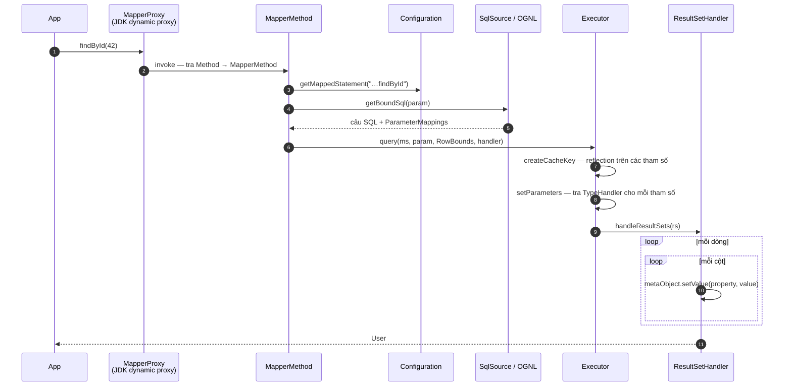
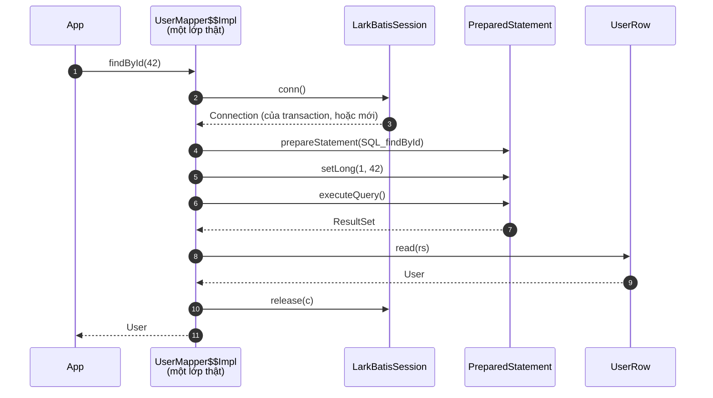

# Vòng đời một lời gọi

Một lời gọi mapper, theo cả hai cách. Cùng interface, cùng SQL, cùng kết quả.

```java
User u = mapper.findById(42);
```

## MyBatis



Bốn nhóm công việc dùng reflection trên đường đó: `createCacheKey`, `getBoundSql` (OGNL
khi statement là động), `setParameters`, và `handleResultSets`. Cái cuối là cái đắt nhất,
vì nó chạy trên mỗi cột của mỗi dòng.

## LarkBatis



Không proxy, không tra cứu, không đánh giá. Những bước biến mất không hề chuyển đi đâu
khác. Chúng đã được thực hiện lúc build, và câu trả lời của chúng nằm ngay trong mã nguồn
dưới dạng hằng.

## Phép gán một cột, đặt cạnh nhau

Đây là chỗ khác biệt đo được nằm ở. Với **mỗi cột của mỗi dòng**, MyBatis làm:

```java
metaObject.setValue("userName", v)
//  ① new PropertyTokenizer(name)        cấp phát + indexOf + substring
//  ② BeanWrapper.set(prop, value)
//  ③ metaClass.getSetInvoker(name)      tra HashMap theo String
//  ④ Object[] params = { value }        cấp phát
//  ⑤ method.invoke(obj, params)         lời gọi bằng reflection
```

LarkBatis làm:

```java
u.setUserName(rs.getString(4));
// tên property đã biến mất từ lúc build
// chỉ số cột 4 đã được chọn từ lúc build
// thứ còn lại là một lệnh putfield
```

Với một kết quả 10 cột × 1.000 dòng, đó là **10.000 lần cấp phát `PropertyTokenizer` +
10.000 lần cấp phát `Object[]` + 10.000 lần tra map + 10.000 lời gọi `Method.invoke`**,
để thực hiện 10.000 phép gán mà bản chất chỉ là một lệnh `putfield`.

!!! note "Phần thú vị không nằm ở ⑤"

    Từ JDK 18, reflection lõi được xây trên method handle và một `Method.invoke` đang nóng
    thì rất gần với một lời gọi trực tiếp. Phần tiết kiệm đáng tin nằm ở ①③④, tức là phần
    việc tồn tại *chỉ vì* tên property là một chuỗi phải resolve lúc chạy.

    Điều này cũng dự đoán một thứ mà các phép đo đã xác nhận: escape analysis không dọn
    được chỗ này. Chuỗi `setValue → BeanWrapper → Invoker` quá sâu để JIT thay thế các
    cấp phát đó bằng biến vô hướng. Xem [Hiệu năng](performance.md).

## Cái gì vẫn diễn ra lúc chạy

Chính xác ở điểm này là quan trọng, bởi vì nói "không có việc gì lúc chạy" sẽ là nói dối:

| Vẫn ở lúc chạy | |
|---|---|
| `s.conn()` / `s.release(c)` | Mượn từ pool hoặc từ transaction |
| `ps.setLong(1, 42)` | Bind giá trị, và đó chính là mục đích |
| `ps.executeQuery()` | Lượt đi về với database, chiếm phần lớn một truy vấn một dòng |
| `rs.getString(2)` | Phần việc của chính driver |
| Với statement động: đánh giá mỗi `test` một lần, và nối vào một `StringBuilder` | |
| Với `<foreach>`: một vòng cho placeholder, một vòng cho giá trị | |
| Với `${}` / `<foreach>`: một lời gọi `trackVariants` | Một lần tra `ConcurrentHashMap` |

Thứ đã biến mất là mọi thứ nằm *giữa* lời gọi và những thao tác đó.

## Và đó là lý do lợi ích tỉ lệ với số dòng

Một `findById` trả về một dòng thực hiện phần việc cột bằng reflection 4 lần. Một truy
vấn báo cáo trả về 10.000 dòng thực hiện nó 40.000 lần, và đó là chỗ một truy vấn 3,0 ms
trở thành 0,8 ms. Cùng code, cùng thiết kế; hệ số nhân chính là số dòng.

Nói thẳng ra: **LarkBatis là một khoản đầu tư cho truy vấn báo
cáo, export, batch và màn hình danh sách. Nó gần như không thay đổi gì cho việc tra cứu
một bản ghi.**
