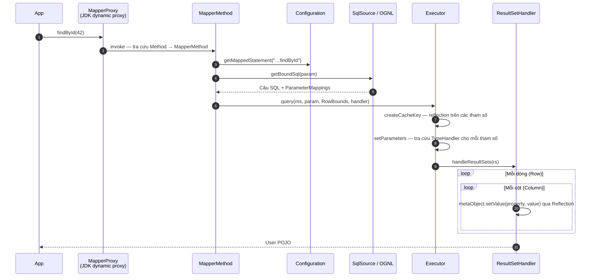
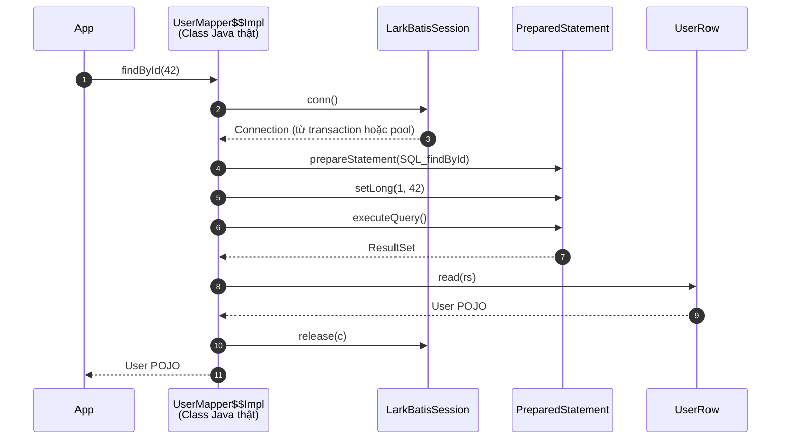

# Vòng đời một lời gọi Mapper (Call Flow)

So sánh luồng thực thi chi tiết của cùng một phương thức mapper:

```java
User u = mapper.findById(42);
```

## Luồng thực thi trong MyBatis truyền thống



MyBatis phải thực hiện reflection ở 4 giai đoạn: `createCacheKey`, `getBoundSql` (OGNL cho dynamic SQL), `setParameters` và `handleResultSets`. Trong đó, `handleResultSets` tiêu tốn nhiều CPU và bộ nhớ nhất vì chạy lặp qua từng cột của từng dòng dữ liệu.

## Luồng thực thi trong LarkBatis



Không dynamic proxy, không tra cứu hash map, không reflection. Mọi thông tin cấu trúc đã được giải quyết từ lúc build và nhúng thẳng dưới dạng hằng số hoặc lệnh gọi Java trực tiếp.

## So sánh chi tiết phép gán dữ liệu từng cột

Với **mỗi cột trên mỗi dòng**, MyBatis thực hiện:

```java
metaObject.setValue("userName", v)
// 1. new PropertyTokenizer(name)   -> Cấp phát heap object + indexOf + substring
// 2. BeanWrapper.set(prop, value)
// 3. metaClass.getSetInvoker(name) -> Tra cứu HashMap theo String
// 4. Object[] params = { value }   -> Cấp phát mảng Object[]
// 5. method.invoke(obj, params)    -> Gọi qua Java Reflection
```

Trong khi LarkBatis thực hiện:

```java
u.setUserName(rs.getString(4));
// 1. Tên property đã được resolve lúc build
// 2. Chỉ số cột (4) đã cố định lúc build
// 3. Thực thi trực tiếp bằng một lệnh bytecode putfield
```

Với kết quả 10 cột × 1.000 dòng, MyBatis tạo ra:
- 10.000 đối tượng `PropertyTokenizer`
- 10.000 mảng `Object[]`
- 10.000 lần tra cứu HashMap
- 10.000 lần gọi `Method.invoke()`

Chuỗi gọi sâu `setValue → BeanWrapper → Invoker` khiến JIT Compiler không thể áp dụng Escape Analysis để loại bỏ việc cấp phát bộ nhớ heap.

## Các thao tác thực tế diễn ra lúc Runtime trong LarkBatis

| Thao tác runtime | Mục đích |
|---|---|
| `s.conn()` / `s.release(c)` | Mượn connection từ transaction hoặc connection pool |
| `ps.setLong(1, 42)` | Bind giá trị tham số vào PreparedStatement |
| `ps.executeQuery()` | Gửi truy vấn xuống database qua JDBC driver |
| `rs.getString(2)` | Đọc dữ liệu từ driver buffer |
| Đánh giá biến boolean và `StringBuilder.append()` | Ghép chuỗi đối với dynamic SQL |
| `trackVariants()` | Kiểm soát số lượng biến thể SQL trong cache |

Toàn bộ các tầng trung gian trừu tượng đã bị loại bỏ hoàn toàn.

## Tác động hiệu năng theo quy mô dữ liệu

- **Truy vấn đơn bản ghi (Single row lookup)**: Thời gian phần lớn nằm ở mạng và database I/O, mức chênh lệch giữa hai framework là không đáng kể.
- **Truy vấn danh sách lớn (Reports, Export, Batch)**: Với 10.000 dòng (40.000 cột), việc loại bỏ reflection và cấp phát heap giúp giảm thời gian xử lý CPU từ 3,0 ms xuống 0,8 ms và giảm áp lực GC rõ rệt.

